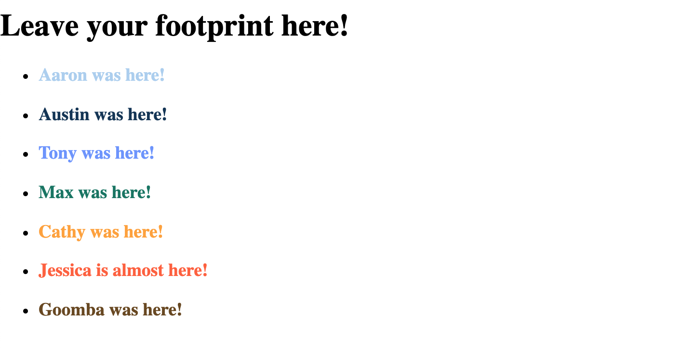
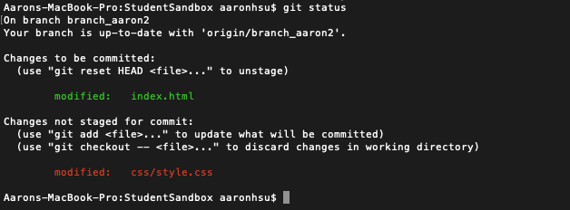
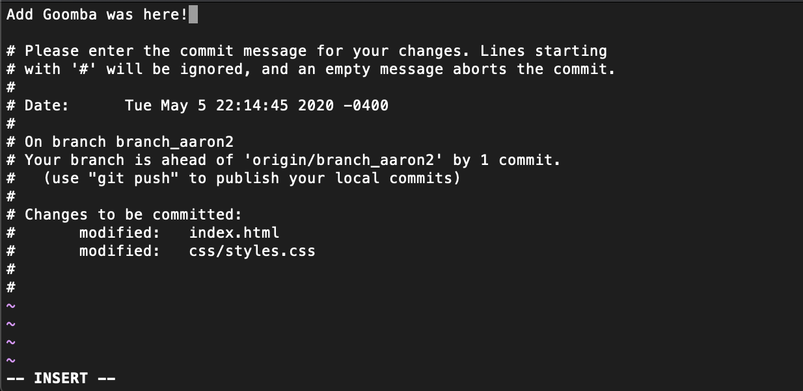
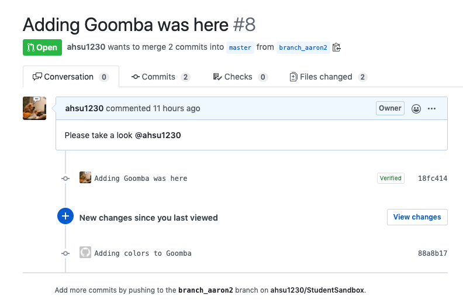

# Edit your Pull Request with the Git CLI

Now that you have Git installed on your computer, we can start using the Git CLI and update the Pull Request that you created a few steps ago.

## Clone this Repo

Find a spot in your computer that you would like to keep all your coding projects. Use Terminal/Command Prompt to traverse to that spot (use `cd`). When you get to the folder, run this command:

Go to <https://github.com/ahsu1230/StudentSandbox> and look for the **Clone or download** button on the right. When you click on it, it will provide a clone link for you. Use this link to clone this repository and create a local copy on your computer.

In the Terminal/Command Prompt, run this command to start cloning this repo.

```git
git clone https://github.com/ahsu1230/StudentSandbox.git
```

Use `ls` to verify that a folder called `StudentSandbox` has been created in your current directory. Use `cd` to go into that folder. If you use `pwd`, you should now see that you're in the `StudentSandbox` folder. Because this is a git repository, you can start using git commands as long as you are in this directory.

## Retrieving your changes

If you look at the files in your local repo, you should now see all the files that are part of this Git project. However, notice that in `index.html`, your change is NOT present. This is because the content we just downloaded is from the `master` branch. But we created a Pull Request off a different branch and have not merged it to `master` yet.

Run this command to see what local branch you are currently on. You should only see `master`.

```git
git branch
```

To grab the contents from the branch you created, enter the following command:

```git
git checkout -b YOUR_BRANCH_NAME origin/YOUR_BRANCH_NAME
```

`YOUR_BRANCH_NAME` should be replaced by whatever your named your branch in the previous step. In my example, my branch name was called `branch_aaron2`. So my command looks like this: `git checkout -b branch_aaron2 origin/branch_aaron2`.

This command takes the remote branch `branch_aaron2` from Github and pulls (a.k.a. downloads) it to a new local branch with the same name. It's advised to have corresponding remote and local branches be the same name to avoid confusion. Now, if you look at `index.html`, you should see the new changes that you edited in the Pull Request.

## Make More Changes

We're going to continue editing our Pull Request. To edit these files, the fastest way would probably be to use Vim. But installing and using any of these popular Text Editors is fine too.

- [Vim](./06a_vim.md) *recommended*
- [VSCode](https://code.visualstudio.com/)
- [Atom](https://atom.io/)
- [Sublime Text](https://www.sublimetext.com/)

Open these files with a text editor and make the corresponding changes.

1. Open `index.html` and add a class to your header

```html
<li><h3 class="goomba">Goomba was here!</h3></li>
```

2. Open `css/style.css` and define your CSS class with a color of your choice

```css
.goomba {
  color: #______;
}
```

3. Test your code by opening `index.html` with an Internet browser (like Chrome). When you do this, you should see your text line with the hexadecimal color. Click [here](https://www.w3schools.com/colors/default.asp) to learn more about hexadecimal colors and click [here](https://www.w3schools.com/colors/colors_picker.asp) to help you select a color.



## Checking Git status

Great, now that you are done editing your files to complete the feature, it's time to create a commit and push that commit to the remote.

Use this command to check which files have changed. You should see two files when this command returns: `index.html` and `css/style.css`.

```git
git status
```

Use this command to check how every file has changed. The green lines (beginning with `+`) at the beginning means lines you've added. The red lines with (starting with `-`) you've deleted.

```git
git diff
```

*Note* `git diff` will bring you into this weird program called `vim`. You'll notice you can't input any commands after you use `git diff`. We'll talk about it later, but for now simply press `q` to exit out of `git diff`.

## Staging and unstaging files

Before creating a commit, you need to specify which files you want to actually want to include in the commit. Often times, it will be all the files you just changed. But sometimes, we don't want to commit everything, so there is a *stage* step before the commit step.

Use this command to indicate that you want to stage a certain file before the commit. In this step, we want to stage BOTH the `index.html` and `style.css` files.

```git
git add <FILE_NAME>
```

Or as a shortcut, use `git add -A` to stage all changed files. Check the status of your current git situation using `git status`. You should see that the changed files are "staged" under the *Changes to be committed* section. The screenshot is just an example showing the difference between a staged and unstaged file. The files marked green are staged (ready to be committed) while the files marked red are unstaged (will not be committed). At this point, however, both of your files should be staged.



## Creating a Commit

You can only create a commit if you have at least one staged file. Use this command to actually create the commit. When you create a commit, you must include a short message that gives a "one-line" summary of your changes.

```git
git commit -m "YOUR_MESSAGE_HERE"
```

Check your status again using `git status`. You should see no unstaged files (because they're now committed). You should also see a message like this from your `status` command.

## Using Vim with Git

Git comes with an interal editor which you'll need to use in order to fully use many git functions. The internal editor is called Vim which is a "primitive", but very nifty text editor that's been used since 1990! We'll make a small edit to our git commit message using this command:

```git
git commit --amend
```

View this short tutorial to learn how to use Vim [here](./06a_vim.md). 

Using the above command will automatically take you to the *Command* mode of Vim. Make a small edit to your commit message and when you are done, escape out of Vim's *INSERT* mode (and into *Command* mode) and enter: `:wq` (colon-w-q-Enter) to save your work and quit vim. If you don't want to continue editing, again, escape out of Vim's *INSERT* mode and use `:q!` (colon-q-!-Enter) to quit out and abort your edits.



## Pushing your commits

```git
On branch branch_aaron2
Your branch is ahead of 'origin/branch_aaron2' by 1 commit.
(use "git push" to publish your local commits)
```

We're on the right track. This means that your local branch has a commit that the remote branch does not have on Github. Once your local branch is at least a commit ahead of the remote branch, it's time to push (a.k.a. upload) the new commits to the remote. Use this command to push commits to the remote.

```git
git push origin YOUR_BRANCH_NAME
```

## Review Pull Request on Github

If everything works, your Pull Request on Github should now reflect the additional change you just made! Observe the second commit message you just created.



Great work! Take a moment to look at the `Commits` tab. You should see a timeline of 2 commits. If you look for the `<>` button on the right, when you hover over it, the button will allow you to *browse the repository at this point in the history*. Remember, commits are just snapshots of the repository. The current snapshot of your branch contains the most recent snapshot that you pushed to this remote branch.

Now gander over to the `Files changed` tab. This tab allows you to see ALL differences between the most recent commit and the original starting point (which is the `master` branch). With this tab, now teammates can see what code you intend to add/change/remove. As a teammate who is reviewing your code, I can hover over a code line and click on the blue "+" sign to make a comment.

## Notify your teammate

Awesome job getting here! Now ping me through email / slack to tell me that your Pull Request is ready. Please also include the url link in your message!

---

[Continue](./07_recap.md)
