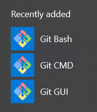

# What is Vim?

Vim is just a very simple text editor built into Command Line Interfaces across all operating systems. Unlike a personal computer, many machines are often optimized to only run the programs they need to, so they won't be installing extra programs like Notepad, SublimeText, Atom, etc. just to edit text files. These extra programs would take up too much computer resources and bump into version compatibility issues or unnecessary bugs. Vim is a pretty old program (available since 1990s), so it is super stable across all platforms.

From this article <https://medium.com/@fay_jai/what-is-vim-and-why-use-vim-54c67ce3c18e>, the author talks about what makes Vim so special: Efficiency and Ubiquity.

TLDR:
> Efficiency: Vim allows you to be efficient by forcing you to only use the keyboard (yes, that means no more mouse!) and then giving you the ability to use existing keyboard shortcuts as well as customize and create new ones for completing repetitive tasks quickly.

> Uniquity: It’s available on basically every major platform you can think of. Whether you’re using a Mac, Windows, or some Linux distribution, Vim’s got you covered.

Vim might seem pretty annoying to use at first and definitely has a learning curve. But, with a little bit of memorization and practice, you'll be able to get yourself around text files super quickly (and without a mouse!). If you ever want to meet a real-life wizard, go find a Vim-pro!

***NOTE*** For Windows, it's best to use Vim through Git Bash. Command Prompt does not automatically come with vim and Github so instead of installing both, use the Git Bash CLI program that will come with both. Git Bash should've been automatically installed when you installed Git on Windows. Git Bash is a program that allows you to use linux commands on Windows, so instead of following Windows CLI commands, follow the [Mac/Linux commands instead](./04_intro_cli.md).



## Basic Vim Commands

Please take a look at this short video to see how to use Vim: <https://www.youtube.com/watch?v=ggSyF1SVFr4>

In Vim, there are several modes - two of which are the *Command* mode and the *Insert* mode. The *Insert* mode lets you type in characters and do the heavy duty text editing. The *Command* mode is where most of the short commands and shortcuts come into play to do very simple tasks super fast. When you enter Vim, by default, you'll be in the *Command* mode.

### In Command Mode

- `i` Enter Insert mode
- `:q` quit (cannot quit if you made changes)
- `:w` save
- `:wq` save and quit
- `:q!` force quit (will abort any changes to the file)
- `dd` delete an entire line
- `u` undo the last change
- `x` delete a single character
- `r` replace the current character with the next character you input
- `Ctrl-r` redo the last change
- `/PATTERN` searches entire file for PATTERN
- `%s/PATTERN/REPLACE/g` replaces all PATTERN with REPLACE

For more Vim commands, you can also view this video: <https://www.youtube.com/watch?v=g-XsXEsd6xA>

### In Insert Mode

In this mode, you can insert and delete characters (using the Backspace) as "normal". This is your main "writing" mode.

- `ESC` Exit Insert Mode, revert back to Command mode

### Using Vim directly

If you ever want to edit files directly (without using Git), you can simply use:

```unix
vi FILE_NAME
```

And it will open the file in Vim to Command Mode.

If Vim is not installed on your machine for some reason, follow the directions on this page: <https://www.vim.org/git.php>. This page will have you install Vim through Github. You'll want to use `git clone` in a directory outside of this `StudentSandbox` repository. *You may have to restart Terminal or Command Prompt after installtion.*
